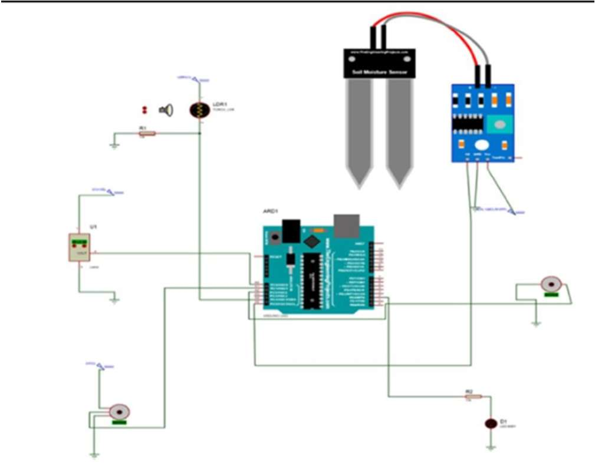
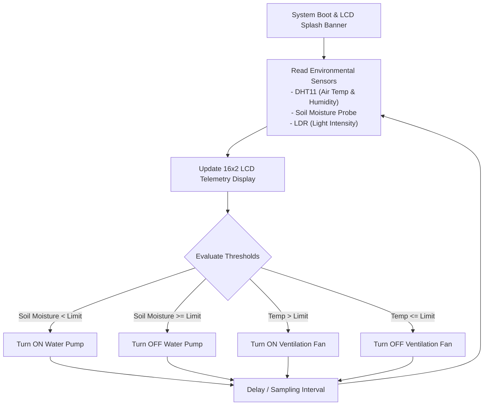

# Greenhouse Monitoring Using Arduino

An automated greenhouse environmental monitoring and actuation control prototype built with Arduino, DHT11 temperature and humidity sensors, analog soil moisture probes, LDR light sensors, and an HD44780 16x2 LCD display.

Developed as an academic engineering project at RV Institute of Technology and Management (RVITM), Bengaluru, this system automates climate regulation and soil irrigation for optimal crop cultivation.

---

## Features

- **Multi-Parameter Environmental Sensing**:
  - Ambient air temperature and relative humidity sensing via DHT11 digital sensor.
  - Soil moisture content monitoring via analog probe to prevent under-watering or waterlogging.
  - Ambient illumination tracking using a Light Dependent Resistor (LDR) voltage divider.
  - Real-time heat index ($HI$) estimation.
- **Autonomous Environmental Actuation**:
  - DC ventilation fan activation for temperature relief and airflow regulation.
  - DC submersible water pump / irrigation valve switching based on soil humidity thresholds.
  - Supplemental lighting (grow bulb) control under low ambient sunlight conditions.
- **Real-Time Visual Telemetry**:
  - 16x2 Liquid Crystal Display (LCD) cyclically reporting:
    - Ambient Temperature ($^\circ\text{C}$) and Air Humidity ($\%$)
    - Soil Moisture Percentage ($\%$)
    - Actuator states (`Vent fan: ON/OFF`, `Sprinkler: ON/OFF`)
    - Startup system diagnostic banner.
- **Self-Contained Embedded Logic**:
  - Low-power, deterministic microcontroller loop running on the ATmega328P without external cloud dependencies.

---

## Hardware Specification

### Core Components
- **Microcontroller**: Arduino Uno / Nano (Microchip ATmega328P @ 16 MHz, 5V logic).
- **Sensors**:
  - **DHT11**: Single-wire digital temperature (0–50$^\circ\text{C} \pm 2^\circ\text{C}$) and humidity (20–90% RH $\pm 5\%$).
  - **Soil Moisture Sensor**: Resistive probe with analog comparator output.
  - **Light Dependent Resistor (LDR)**: Photoconductive cell in voltage divider configuration.
- **Display**: 16x2 Character LCD (Hitachi HD44780 parallel controller).
- **Power & Actuation**:
  - 5V optocoupled relay module.
  - 12V/5V DC cooling/ventilation fan.
  - 5V/12V mini DC water submersible pump.
  - Supplemental incandescent/LED bulb.
  - External DC power supply for inductive actuator loads.

---

## Circuit Diagram & Electrical Wiring

Below is the system electrical wiring diagram interfacing the Arduino Uno microcontroller with the DHT11 temperature/humidity sensor, analog soil moisture probe, LDR sensor, 16x2 HD44780 LCD display, and actuator relays:

<p align="center">
  
</p>

---

### Pin Allocations

| Subsystem | Arduino Pin | Type | Function |
| :--- | :--- | :--- | :--- |
| **DHT11 Sensor** | D2 / D7 | Digital I/O | Single-bus bidirectional sensor data |
| **LCD RS** | D12 | Digital Output | Register Select |
| **LCD Enable (EN)**| D11 | Digital Output | Enable strobe signal |
| **LCD Data D4** | D5 | Digital Output | High-nibble data bit 4 |
| **LCD Data D5** | D4 | Digital Output | High-nibble data bit 5 |
| **LCD Data D6** | D3 | Digital Output | High-nibble data bit 6 |
| **LCD Data D7** | D2 | Digital Output | High-nibble data bit 7 |
| **Soil Moisture** | A0 | Analog Input | Voltage proportional to soil moisture |
| **LDR Sensor** | A1 | Analog Input | Ambient light intensity reading |
| **Relay: Water Pump**| D9 | Digital Output | Soil irrigation control |
| **Relay: Vent Fan** | D10 | Digital Output | Greenhouse cooling control |

---

## Project Structure

```text
Greenhouse-Monitoring-Using-Arduino/
├── sketch_may27d/
│   └── sketch_may27d.ino             # Main multi-parameter controller & LCD display sketch
├── This_is_the_code_to_print_DHT_sensor_value_on_the_LCD_screen.tx/
│   └── This_is_the_code_to_print_DHT_sensor_value_on_the_LCD_screen.tx.ino # Standalone DHT11 & heat index verification
├── report.docx                       # Comprehensive academic technical report
├── iot ppt.pdf                       # Project presentation slide deck
├── .gitignore                        # Git ignore patterns
└── README.md                         # Project documentation
```

---

## Software & Setup

### Requirements
- [Arduino IDE](https://www.arduino.cc/en/software) (version 1.8.x or 2.x) or Arduino CLI.
- Standard libraries:
  - `LiquidCrystal.h` (Built into Arduino core)
  - `DHT.h` / `DHT11.h`

### Uploading Firmware
1. Connect the Arduino Uno or Nano to your workstation via USB.
2. Open `sketch_may27d/sketch_may27d.ino` in the Arduino IDE.
3. Select the board (**Tools > Board > Arduino Uno** or **Nano**).
4. Select the matching serial communication port (**Tools > Port**).
5. Click **Upload** (or press `Ctrl+U`).

---

## System Workflow



---

## Credits & Acknowledgements

- **Hardware Prototype & Firmware Development**: Kausthubh Viswanath
- **Technical Report & Presentation**: Medhya Parthakudi, Kausthubh Viswanath
- **Department**: Department of Electronics and Communication Engineering, RV Institute of Technology and Management (RVITM), Bengaluru.

---

## License

Academic and educational project. All rights reserved by the original authors.
